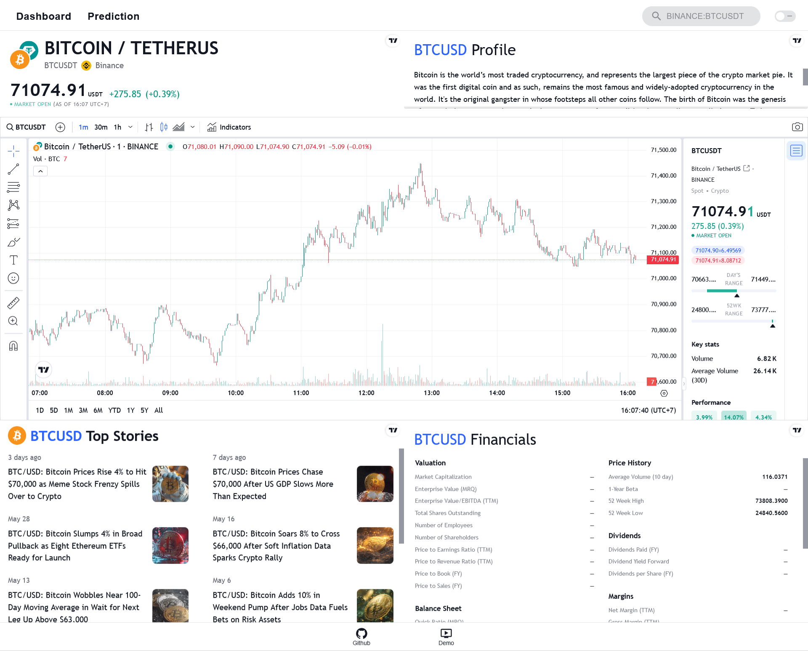
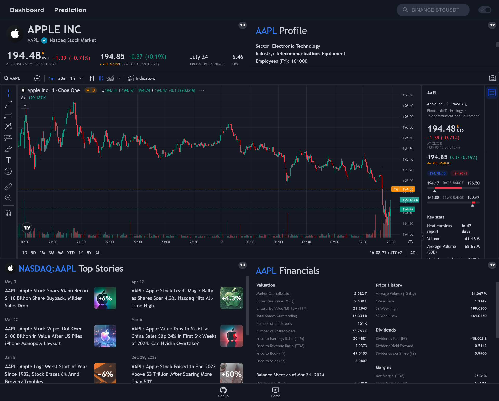
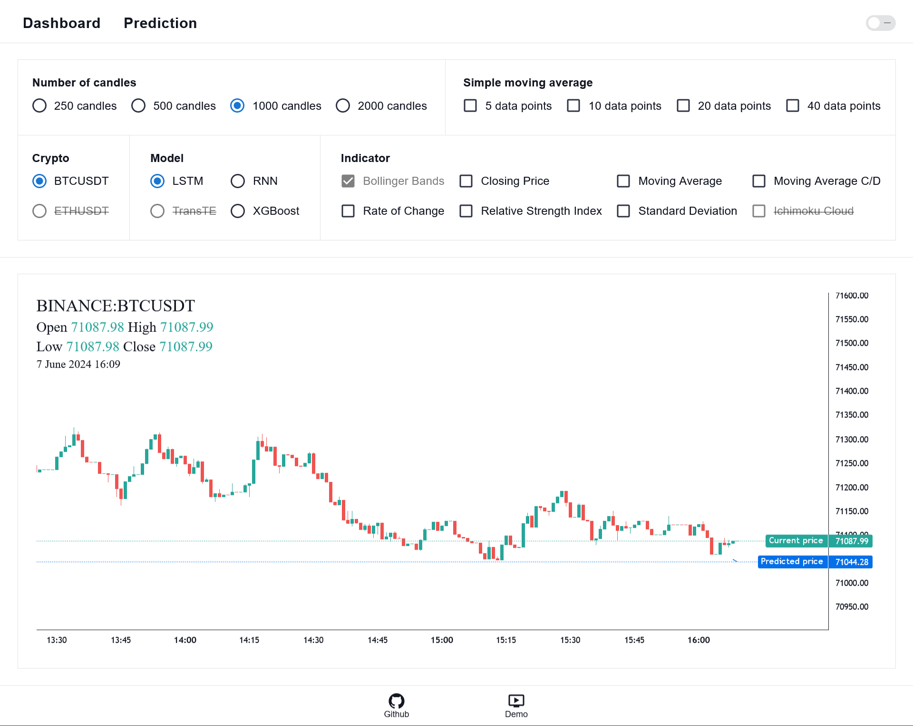

# [CSC13115 - Modern Software Development Technologies] Final Group Project

## Topic: TradingView Widgets Dashboard and Bitcoin Price Prediction

### Overview

The project aims to create an overview dashboard using TradingView Widgets and to predict Bitcoin prices utilizing machine learning algorithms.

### Group Members

1. Tăng Trường Long - 18127139
2. Mai Thanh Bình - 1753030
3. Lương Trường Thịnh - 19127559

### Preview

1. Dashboard page with light theme:

   

2. Dashboard page with dark theme:

   

3. Prediction page with light theme:

   

4. Prediction page with dark theme:

   

### Features

1. Overall:

   - [x] Responsive UI: User-friendly interface that scales well across various screen sizes.
   - [x] Theme Toggle: Switch between dark and light themes.

2. Dashboard page:

   - [x] Dashboard Integration: Incorporates TradingView Widgets for real-time data visualization.
   - [x] Search Functionality: Enter symbols such as `BINANCE:BTCUSDT` or `NASDAQ:AAPL`.
   - [ ] Autocomplete Search: Currently, TradingView API doesn't provide a list of symbols, so you must know the exact symbol to search. Alternatively, use the search inside the chart widget.

3. Prediction page:

   - [x] Lightweight Charts Implementation: Uses Lightweight Charts for improved visualization over traditional Python Plotly visualizations.
   - [x] Price Prediction: Utilizes machine learning algorithms to predict future prices.
   - [ ] Prediction History: Currently, prediction history resets upon page reload or site exit. Future plans include adding Redis for caching past predictions.
   - [ ] Up-to-Date Model: The current trained model is based on data up to September 2023. While it can still predict future prices, significant price changes since then may affect accuracy. Future updates may include AutoML for frequent model retraining.
   - [x] Conditional Menu: Customize options to suit your preferences.
     - Number of Candles: TradingView limits real-time candles to around 2400.
       - [x] 250 candles
       - [x] 500 candles
       - [x] 1000 candles
       - [x] 2000 candles
     - Simple Moving Average: Various SMA options for reference and comparison.
       - [x] 5 data points
       - [x] 10 data points
       - [x] 20 data points
       - [x] 40 data points
     - Crypto Support: Currently supports Bitcoin with plans to expand.
       - [x] Bitcoin
       - [ ] Ethereum
     - Model Types: Different machine learning algorithms.
       - [x] Long short-term memory
       - [x] Recurrent neural network
       - [x] eXtreme Gradient Boosting
       - [ ] Transformers and Time Embeddings
     - Technical Indicators: Various technical indicators available.
       - [x] Bollinger Bands
       - [x] Closing Price
       - [x] Moving Average
       - [x] Moving Average Convergence/Divergence
       - [x] Rate of change
       - [x] Relative Strength Index
       - [x] Standard Deviation
       - [ ] Ichimoku Cloud

### Installation

1. Clone the repository:

   ```
   git clone https://github.com/mtbinhitus/cnm-stock-prediction.git
   ```

2. Navigate to the `client-react` folder:

   ```
   cd cnm-stock-prediction/client-react
   ```

   If you are already in `cnm-stock-prediction`:

   ```
   cd client-react
   ```

3. Install dependencies:

   ```
   npm install
   ```

4. Create a `.env` file from the `.env.example` file, you can decide what IP and port you want your React app to fetch data from:

   

5. Start the frontend:

   ```
   npm start
   ```

6. Wait for the code to compile; the application will run on `localhost:3000`.

7. Open another terminal.

8. Navigate to the `server-python` folder:

   ```
   cd cnm-stock-prediction/server-python
   ```

   If you are already in `cnm-stock-prediction`:

   ```
   cd server-python
   ```

9. Install dependencies:

   ```
   pip install -r requirements.txt
   ```

10. Navigate to the `server` folder:

    ```
    cd server
    ```

11. Create initial migrations:

    ```
    python manage.py makemigrations
    ```

12. Apply migrations:

    ```
    python manage.py migrate
    ```

13. Follow this tutorial to create your API keys on Binance:

    ```
    https://www.binance.com/en/support/faq/how-to-create-api-keys-on-binance-360002502072
    ```

14. Create a `.env` file from the `.env.example` file, then insert your `BINANCE_API_KEY` and `BINANCE_API_SECRET_KEY`:

    

15. Start the backend:

    ```
    python manage.py runserver
    ```
