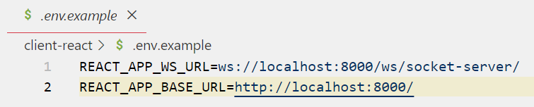
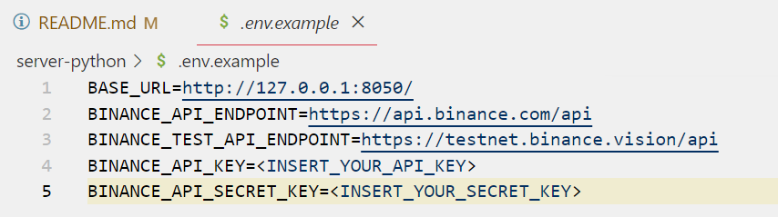

# [CSC13115 - Modern Software Development Technologies] Final Group Project

## Topic: TradingView Widgets Dashboard And Bitcoin Price Prediction Using Machine Learning

### Overview

This repository hosts the final group project for CSC13115 - Modern Software Development Technologies. The project focuses on developing a dashboard page for analyzing and predicting the prices of stocks and coins utilizing machine learning techniques.

### Group Members

1. **Tăng Trường Long** - 18127139
2. **Mai Thanh Bình** - 1753030
3. **Lương Trường Thịnh** - 19127559

### Features

- **Data Visualization:** Presenting historical price data and trends through interactive charts and graphs.
- **Machine Learning Models:** Implementing predictive models to forecast future prices based on historical data.
- **User-Friendly Interface:** Designing an intuitive dashboard interface for easy navigation and analysis.
- **Customization Options:** Providing users with options to customize and personalize their dashboard experience.
- **Responsive Design:** Ensuring compatibility with various devices and screen sizes for seamless user experience.

### Installation

1. Clone the repository:

   ```
   git clone https://github.com/mtbinhitus/cnm-stock-prediction.git
   ```

2. Navigate to the `client-react` folder:

   ```
   cd cnm-stock-prediction/client-react
   ```

   If you are already in `cnm-stock-prediction`:

   ```
   cd client-react
   ```

3. Install dependencies:

   ```
   npm install
   ```

4. Create a `.env` file from the `.env.example` file, you can decide what IP and port you want your React app to fetch data from:

   

5. Start the frontend:

   ```
   npm start
   ```

6. Wait for the code to compile, the application will run on `localhost:3000`.

7. Open another terminal.

8. Navigate to the `server-python` folder:

   ```
   cd cnm-stock-prediction/server-python
   ```

   If you are already in `cnm-stock-prediction`:

   ```
   cd server-python
   ```

9. Install dependencies:

   ```
   pip install -r requirements.txt
   ```

10. Navigate to the `server` folder:

    ```
    cd server
    ```

11. Create initial migrations:

    ```
    python manage.py makemigrations
    ```

12. Apply migrations:

    ```
    python manage.py migrate
    ```

13. Follow this tutorial to create your API keys on Binance:

    ```
    https://www.binance.com/en/support/faq/how-to-create-api-keys-on-binance-360002502072
    ```

14. Create a `.env` file from the `.env.example` file then insert your `BINANCE_API_KEY` and `BINANCE_API_SECRET_KEY`:

    

15. Start the Backend:

    ```
    python manage.py runserver
    ```
